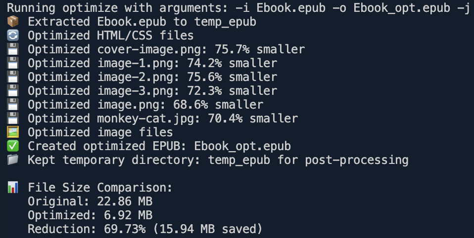

# About This Project

I use this project to optimize EPUB files that I create using Pages on Mac. My workflow is:

- Write (text and images) in Pages.
- Insert a TOC page via the menu: "Insert > Table of Contents > Document". (In the script, I update the generated `epb.opf` and `toc.xhtml` files to add the book cover as a clickable item in the summary.)
- Export my work as an EPUB file.
- Fill in the required information.
- For "Cover": check the option "Use the first page as the book cover image".
- For "Layout": check the reflowable option, and check both "Use table of contents" and "Embed fonts".

After exporting, my original EPUB file is about 24.4MB. I use this script to optimize it (resulting in about 7.3MB). Then I test the result in Apple Books, Kindle Previewer, etc.

This script is designed for this workflow (I don't use any other tools), but anyone who wants to optimize their EPUB file is welcome to try it! If you have any questions or issues, let me know. Enjoy! :)

# EPUB Optimizer

A Node.js utility to optimize EPUB files by compressing HTML, CSS, images and recompressing the archive. This tool can significantly reduce EPUB file sizes while maintaining compatibility with e-readers and ensuring EPUB specification compliance.



## Features

- HTML/XHTML minification (removes whitespace, comments, and unnecessary code)
- CSS optimization (minifies and combines rules)
- Image compression (JPEG, PNG, WebP, GIF, AVIF, SVG optimization without significant quality loss)
- Archive recompression (more efficient zip packaging)
- EPUB validation against the EPUB specification
- XML/XHTML validation fixing (automatically repairs common validation issues)
- Modular fix scripts for EPUB and OPF structure
- Command-line interface with customizable options
- File size comparison reporting

## Requirements

- Node.js 14 or higher (my version: v23.11.0)
- Java Runtime Environment (JRE) 1.7 or higher (my version: openjdk 23.0.2)
- pnpm (my version: 9.5.0)
- npm or pnpm for package management

## Installation

### Local Installation

```bash
# Clone the repository
git clone https://github.com/kiki-le-singe/epub-optimizer.git
cd epub-optimizer

# Using npm
npm install

# Using pnpm
pnpm install
```

### Global Installation

```bash
# Using npm
npm install -g epub-optimizer

# Using pnpm
pnpm install -g epub-optimizer
```

### EPUBCheck Setup

This tool requires EPUBCheck to validate EPUB files. Follow these steps:

1. Download EPUBCheck from the [official website](https://www.w3.org/publishing/epubcheck/)
2. Extract the downloaded zip file
3. Copy the extracted `epubcheck-x.x.x` folder (where x.x.x is the version) to the root of this project
4. Make sure the folder is named `epubcheck` to match the path in `epubcheckPath` in src/utils/config.js

## Usage

### Scripts

The project includes the following scripts (see also the `package.json`):

| Script          | Description                                                                     |
| --------------- | ------------------------------------------------------------------------------- |
| `optimize`      | Optimize the EPUB file (compression, minification, image optimization)          |
| `optimize:keep` | Optimize and keep temp files for debugging                                      |
| `fix`           | Run all fix scripts on extracted files (fixes span tags, XML, and XHTML issues) |
| `create-epub`   | Repackage EPUB from temp directory                                              |
| `validate`      | Validate EPUB with EPUBCheck                                                    |
| `build`         | Full pipeline: optimize, fix, repackage, validate                               |
| `cleanup`       | Remove temp and intermediate files                                              |
| `build-clean`   | Full pipeline and cleanup                                                       |
| `lint`          | Lint code with Biome                                                            |
| `format`        | Format code with Biome                                                          |

### Basic Usage

```bash
# Complete optimization, fixing, and validation
pnpm build

# Complete optimization with custom input/output
pnpm build -i /path/to/books/mybook.epub -o /path/to/output/mybook_optimized.epub

# Optimize, fix, validate and clean up temporary files
pnpm build-clean

# Optimize, fix, validate, clean up with custom input/output
pnpm build-clean -i /path/to/books/mybook.epub -o /path/to/output/mybook_optimized.epub

# Validate a specific EPUB file (dynamic)
pnpm validate -o /path/to/output/mybook_optimized.epub

# Individual steps
pnpm optimize        # Only compress the EPUB file
pnpm fix             # Fix XML/XHTML validation issues
pnpm validate        # Check EPUB validity (uses the correct output file if -o is provided)
```

### Advanced Usage Examples

```bash
# Process a file with a specific name
pnpm optimize -- -i mynovel.epub -o mynovel_optimized.epub

# Specify custom JPEG quality (higher quality, larger file)
pnpm optimize -- --jpg-quality 85

# Keep temporary files for inspection
pnpm optimize:keep

# Process files in another location
pnpm optimize -- -i /path/to/books/mybook.epub -o /path/to/output/mybook_optimized.epub
```

### Command Line Options

```
Usage: epub-optimize [options]

Options:
  -i, --input       Input EPUB file path                       [string] [default: "mybook.epub"]
  -o, --output      Output EPUB file path                      [string] [default: "mybook_opt.epub"]
  -t, --temp        Temporary directory for processing         [string] [default: "temp_epub"]
  -k, --keep-temp   Keep temporary files after processing      [boolean] [default: false]
  --jpg-quality     JPEG compression quality (0-100)           [number] [default: 70]
  --png-quality     PNG compression quality (0-1 scale)        [array] [default: [0.6, 0.8]]
  -h, --help        Show help                                  [boolean]
  -v, --version     Show version number                        [boolean]

Examples:
  epub-optimize -i book.epub -o book-optimized.epub   Optimize a specific EPUB file
  epub-optimize -i /path/to/book.epub                 Optimize a file from another directory
```

## Project Structure

```
epub-optimizer/
├── optimize-epub.ts         # Main entry point
├── package.json             # Package configuration
├── README.md                # Documentation
├── epubcheck/               # EPUBCheck for EPUB validation (not included in repo, see 'EPUBCheck Setup' below)
├── scripts/                 # Helper scripts
│   ├── build.ts             # Full optimization pipeline script
│   ├── build-clean.ts       # Full pipeline with cleanup script
│   ├── create-epub.ts       # EPUB packaging script
│   │   └── index.ts         # Entry point for all general fixes
│   ├── fix/                 # General fix scripts (modular)
│   │   ├── fix-span-tags.ts
│   │   ├── fix-xml.ts
│   │   └── index.ts         # Entry point for all general fixes
│   ├── opf/                 # OPF-specific modifications (fixes, options, or features)
│   │   ├── add-cover-image-property.ts
│   │   ├── update-cover-linear.ts
│   │   └── update-opf.ts    # Entry point for all OPF fixes
│   └── validate-epub.ts     # EPUB validation script
└── src/                     # Source code directory
    ├── index.ts             # Main application logic
    ├── cli.ts               # Command-line interface
    ├── processors/          # Processing modules
    │   ├── archive-processor.ts  # EPUB extraction/compression
    │   ├── html-processor.ts     # HTML/CSS processing
    │   └── image-processor.ts    # Image optimization
    └── utils/               # Utility modules
        └── config.ts        # Application configuration
```

## Modular Fix Scripts

- **General fixes** (e.g. span tags, XML/XHTML) are managed in `scripts/fix/` and run via `scripts/fix/index.ts`.
- **OPF-specific modifications** (fixes, options, or features) are managed in `scripts/opf/` and run via `scripts/opf/update-opf.ts`.
- To enable/disable a fix, comment or uncomment the relevant `execSync` line in the corresponding index/entry file.
- To add a new fix, create a new script in the appropriate folder and add an `execSync` call in the index/entry file.

## Troubleshooting

### Common Issues

1. **"Error: Unable to access jarfile"**: Make sure Java is installed and EPUBCheck is properly set up in the project root.
2. **XML/XHTML Validation Errors**: If validation fails after optimization, try running the fix script manually:
   ```
   pnpm fix
   ```
3. **Missing Dependencies**: If you get module not found errors, ensure you've run `pnpm install` or `npm install`.
4. **Large Files**: For very large EPUB files, you might need to increase Node.js memory:
   ```
   NODE_OPTIONS=--max-old-space-size=4096 pnpm build
   ```

### Getting Help

If you encounter issues not covered in this documentation, please [open an issue](https://github.com/kiki-le-singe/epub-optimizer/issues) on the project repository.

## Dependencies

- archiver - For creating compressed archives
- cheerio - For robust HTML/XHTML DOM manipulation
- clean-css - For CSS minification
- fs-extra - Enhanced file system operations
- html-minifier-terser - For HTML minification
- sharp - For image optimization (JPEG, PNG, WebP, GIF, AVIF, SVG)
- unzipper - For extracting EPUB files
- yargs - For command-line argument parsing
- epubcheck - For EPUB validation (external dependency)
- @biomejs/biome - For linting and formatting (dev dependency)

## License

MIT
